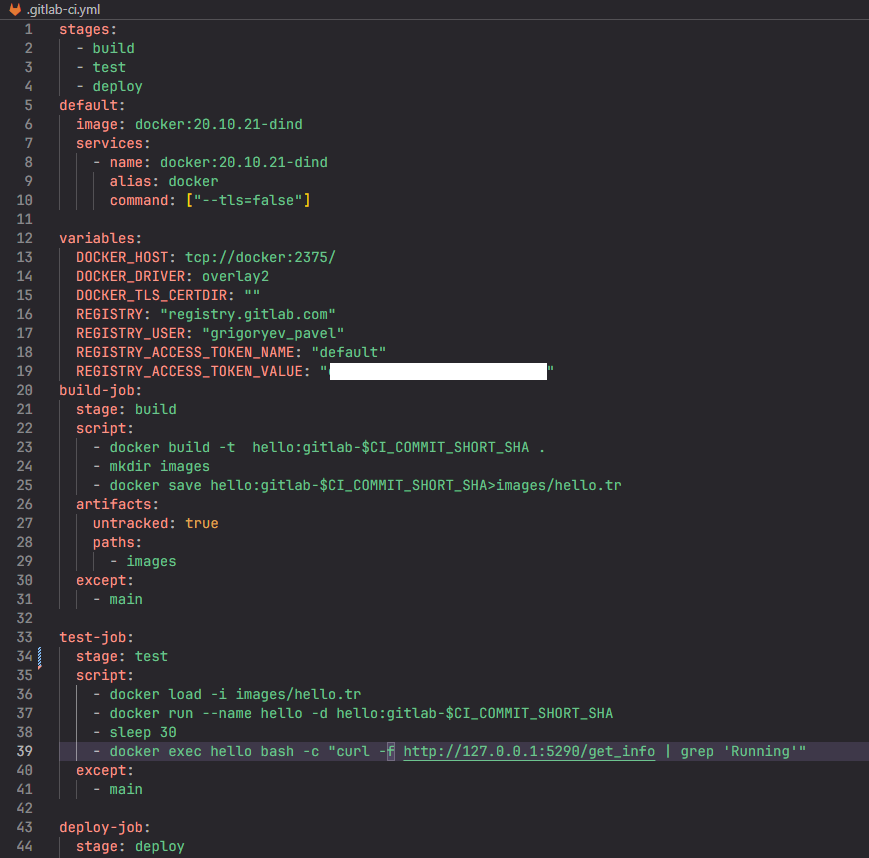
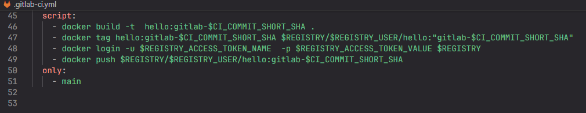
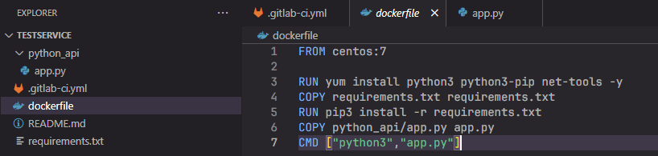
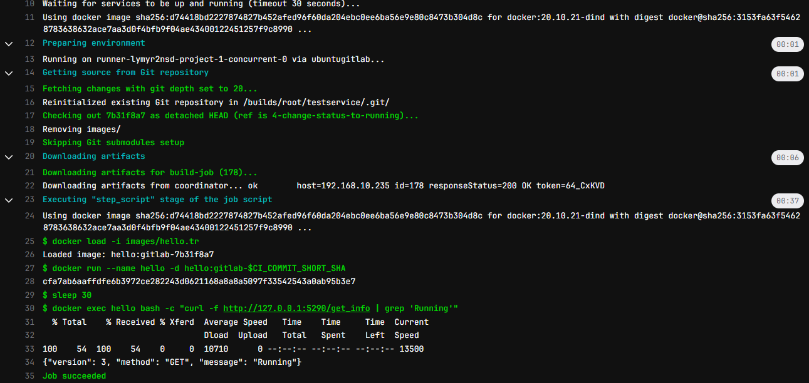
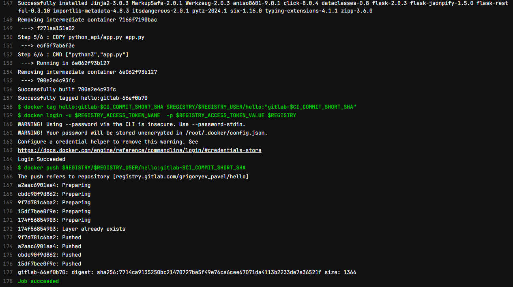
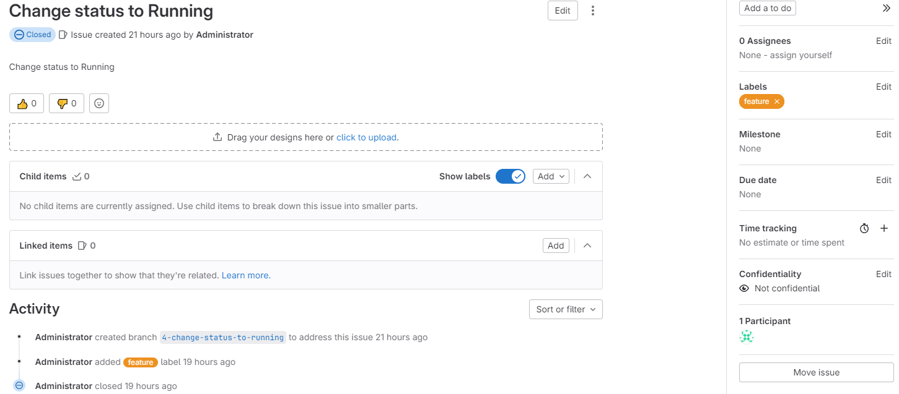

# Домашнее задание к занятию 12 «GitLab»

# Описание

Конвейер состоит из трех этапов:
- build
- test
- deploy
Этапы build и test выполняются автоматически при сохранении изменений в неосновную ветку(отличную от main)
Этап deploy выполняется при слиянии изменений в основную ветку(merge request)
На этапе build образ сохраняется в артифакты командой **docker save <Имя образа>**. Затем этот артифакт загружается в образы командой **docker load -i <Имя файла артифакта>** и происходит запуск контейнера на основе образа командой **docker run <Имя образа>**. Для запуска контейнера требуется 30 секунд, поэтому основной поток останавливается на 30 секунд командой **sleep 30**. Как вариант можно поставить ожидание изменения статуса контейнера командой **docker inspect <Имя контейнера>**

## Содержимое

## 1. Файл конвейера **.gitlab-ci.yml**

Подключение к внешнему хранилищу на gitlab осуществляется на основе access token. Значение token скрыто. 

## 2. Dockerfile

На основании образа centos:7 собирается новый образ, в котором устанавливаются основные зависимости и запускается rest api сервис.
Сервис доступен на адресе http://127.0.0.1:5290/get_info
Ниже приведено содержимое файла Dockerfile:

## 3. Лог успешного выполнения пайплайна

- Лог успешного выполнения сборки и тестирования:

- Лог успешного развертывания образа в репозиторий  gitlab:

## 4. Решённый Issue

